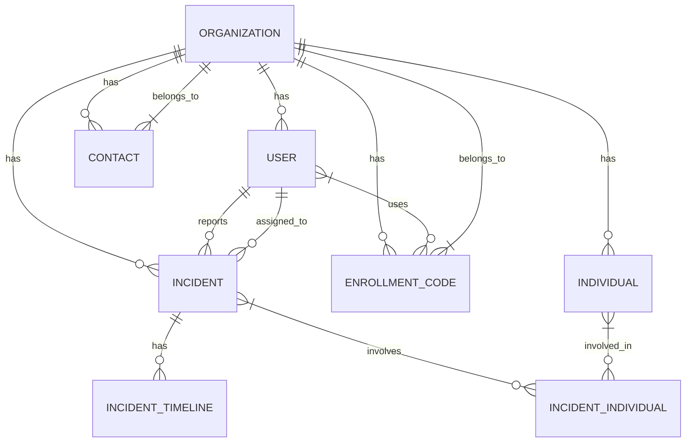

# Tracker System

## 1. System Overview
The Tracker system is a web-based application designed to manage organizations, individuals, and incidents. It includes authentication, authorization, and role-based access control features.

## 2. Data Model

### 2.1 Core Entities

#### User
- **Description**: System users with authentication credentials
- **Inherits**: IdentityUser<Guid>
- **Properties**:
  - Id (Guid, PK)
  - UserName (string)
  - Email (string, required)
  - FirstName (string, required, max 100)
  - LastName (string, required, max 100)
  - PhoneNumber (string, optional, max 20)
  - Role (string, default "Client")
  - IsActive (bool, default true)
  - CreatedAt (DateTime, default now)
  - UpdatedAt (DateTime?, nullable)
  - LastLogin (DateTime?, nullable)

#### Organization
- **Description**: Organizations that use the system
- **Properties**:
  - Id (Guid, PK)
  - Name (string, required, max 200)
  - Type (string, max 20)
  - Phone (string, max 20)
  - Email (string, max 200)
  - Street (string, max 200)
  - City (string, max 100)
  - State (string, max 100)
  - ZipCode (string, max 20)
  - Country (string, max 100)
  - IsActive (bool, default true)

#### Individual
- **Description**: People associated with organizations
- **Properties**:
  - Id (Guid, PK)
  - FirstName (string, required, max 100)
  - LastName (string, required, max 100)
  - DateOfBirth (DateTime?, nullable)
  - Gender (string, max 20, nullable)
  - Email (string, max 200, nullable)
  - Phone (string, max 20, nullable)
  - Street (string, max 200, nullable)
  - City (string, max 100, nullable)
  - State (string, max 100, nullable)
  - ZipCode (string, max 20, nullable)
  - Country (string, max 100, nullable)
  - OrganizationId (Guid, FK, required)

### 2.2 Incident Management

#### Incident
- **Description**: Records of incidents reported in the system
- **Properties**:
  - Id (Guid, PK)
  - Title (string, required, max 200)
  - Description (string, required)
  - Status (string, required, default "Open")
  - Severity (string, required, default "Medium")
  - OrganizationId (Guid, FK, required)
  - ReportedById (Guid, FK, required)
  - AssignedToId (Guid, FK, nullable)
  - CreatedAt (DateTime, default now)
  - UpdatedAt (DateTime?, nullable)
  - IsActive (bool, default true)

#### IncidentIndividual
- **Description**: Join table for Incident-Individual many-to-many relationship
- **Properties**:
  - IncidentId (Guid, FK, PK)
  - IndividualId (Guid, FK, PK)
  - Role (string, required, max 50)
  - Description (string, max 500, nullable)

#### IncidentTimeline
- **Description**: Timeline events for incidents
- **Properties**:
  - Id (Guid, PK)
  - IncidentId (Guid, FK, required)
  - Timestamp (DateTime, default now)
  - Event (string, required, max 100)
  - Description (string, nullable)
  - UpdatedById (Guid, FK, required)

### 2.3 Contact Management

#### Contact
- **Description**: Contact persons for organizations
- **Properties**:
  - Id (Guid, PK)
  - FirstName (string, required, max 100)
  - LastName (string, required, max 100)
  - Email (string, max 200, nullable)
  - Phone (string, max 20, nullable)
  - Department (string, max 100, nullable)
  - Position (string, max 100, nullable)
  - IsPrimary (bool, default false)
  - PreferredContactMethod (string, default "email")
  - OrganizationId (Guid, FK, required)

### 2.4 Authentication & Authorization

#### RefreshToken
- **Description**: Refresh tokens for JWT authentication
- **Properties**:
  - Id (Guid, PK)
  - Token (string, required)
  - Expires (DateTime, required)
  - Created (DateTime, required)
  - CreatedByIp (string)
  - Revoked (DateTime?, nullable)
  - RevokedByIp (string, nullable)
  - ReplacedByToken (string, nullable)
  - ReasonRevoked (string, nullable)
  - UserId (Guid, FK, required)

#### EnrollmentCode
- **Description**: Codes for user enrollment into organizations
- **Properties**:
  - Id (Guid, PK)
  - Code (string, required, max 50)
  - OrganizationId (Guid, FK, required)
  - BeginDate (DateTime, default now)
  - EndDate (DateTime, required)
  - IsActive (bool, default true)
  - Used (bool, default false)
  - UsedAt (DateTime?, nullable)
  - UsedById (Guid, FK, nullable)

## 3. Data Model Structure



## 4. Business Rules

### 4.1 Authentication & Authorization
1. Users must authenticate using email and password
2. JWT tokens are used for authentication
3. Refresh tokens allow for obtaining new access tokens
4. Roles include:
   - Admin: Full system access
   - OrganizationAdmin: Admin for a specific organization
   - Operator: Can manage incidents and individuals
   - Client: Basic user access

### 4.2 User Management
1. Users can belong to multiple organizations
2. Each user has one primary organization
3. Users can be assigned to incidents
4. User accounts can be deactivated

### 4.3 Organization Management
1. Organizations can have multiple users
2. Each organization has a primary contact
3. Organizations can be deactivated

### 4.4 Incident Management
1. Incidents must have a title and description
2. Incidents are associated with an organization
3. Incidents can have multiple individuals involved
4. Each incident maintains a timeline of events
5. Incidents can have attachments

### 4.5 Enrollment Codes
1. Enrollment codes are used to onboard new users
2. Codes have an expiration date
3. Each code can be used once
4. Codes are tied to specific organizations

## 5. Validation Rules

### 5.1 User Validation
- Email must be in valid format
- First and last names are required (max 100 chars each)
- Phone numbers must be in valid format (if provided)

### 5.2 Organization Validation
- Organization name is required (max 200 chars)
- Contact information must be valid (email, phone)

### 5.3 Incident Validation
- Title is required (max 200 chars)
- Description is required
- Status must be one of: Open, InProgress, Resolved, Closed
- Severity must be one of: Low, Medium, High, Critical

### 5.4 Contact Validation
- First and last names are required (max 100 chars each)
- At least one contact method (email or phone) is required

## 6. Security Requirements

1. All passwords must be hashed
2. JWT tokens must be properly signed and validated
3. Refresh tokens must be securely stored
4. API endpoints must be properly authorized
5. Users can only access resources for their organizations
6. Sensitive operations must be logged

## 7. Audit & Logging

1. All system events must be logged
2. Logs must include:
   - Timestamp
   - Event type/level
   - User ID (if applicable)
   - Source
   - Description
   - Any relevant error details

## 8. Data Retention

1. Inactive users should be archived after a configurable period
2. Incident data should be retained according to organizational policy
3. Audit logs should be retained for a minimum of 1 year

## 9. Integration Points

1. Email notifications for:
   - User registration
   - Password resets
   - Incident assignments
   - Status updates
- **City**: String? (optional)
- **State**: String? (optional)
- **ZipCode**: String? (optional)
- **Country**: String? (optional)
- **OrganizationId**: UUID (required, references Organization)
- **Type**: String? (optional, based on organization type)
- **Status**: String (default: "Active")
- **CreatedAt**: DateTime
- **UpdatedAt**: DateTime

#### Contact
- **Id**: UUID
- **FirstName**: String (required)
- **LastName**: String (required)
- **Email**: String? (optional, validated as email)
- **Phone**: String? (optional)
- **Department**: String? (optional)
- **Position**: String? (optional)
- **IsPrimary**: Boolean (default: false)
- **PreferredContactMethod**: String (default: "email")
- **OrganizationId**: UUID (required, references Organization)
- **CreatedAt**: DateTime
- **UpdatedAt**: DateTime

#### EnrollmentCode
- **Id**: UUID
- **Code**: String (required, unique)
- **OrganizationId**: UUID (required, references Organization)
- **BeginDate**: DateTime (default: DateTime.UtcNow)
- **EndDate**: DateTime (required, must be after BeginDate)
- **IsActive**: Boolean (default: true)
- **Used**: Boolean (default: false)
- **UsedAt**: DateTime? (optional)
- **UsedById**: UUID? (optional, references User)
- **CreatedAt**: DateTime
- **UpdatedAt**: DateTime

#### Incident
- **Id**: UUID
- **Title**: String (required)
- **Description**: String (required)
- **Status**: String (default: "Open")
- **Severity**: String (e.g., "Low", "Medium", "High", "Critical")
- **OrganizationId**: UUID (required, references Organization)
- **ReportedById**: UUID (required, references User)
- **AssignedToId**: UUID? (optional, references User)
- **IsActive**: Boolean (default: true)
- **CreatedAt**: DateTime
- **UpdatedAt**: DateTime

#### IncidentTimeline
- **Id**: UUID
- **IncidentId**: UUID (required, references Incident)
- **Event**: String (required, e.g., "Status Changed", "Note Added")
- **Description**: String (required)
- **UpdatedById**: UUID (required, references User)
- **Timestamp**: DateTime (default: DateTime.UtcNow)
- **IsActive**: Boolean (default: true)

#### IncidentIndividual (Junction Table)
- **IncidentId**: UUID (composite PK, references Incident)
- **IndividualId**: UUID (composite PK, references Individual)
- **Role**: String (e.g., "Witness", "Affected", "Reported By")
- **Description**: String? (optional)

### Data Flow
1. Organizations are created first
2. Users are created and associated with Organizations
3. Individuals, Contacts, and EnrollmentCodes are created and linked to Organizations
4. Incidents are created and linked to Organizations, with references to Users
5. IncidentTimeline entries are created as updates to Incidents
```

## Getting Started

### Prerequisites
- .NET 6.0 SDK or later
- SQL Server (local or remote)
- Node.js (for frontend development, if applicable)

### Installation
1. Clone the repository
2. Update connection strings in `appsettings.json`
3. Run database migrations
4. Start the application

## License
This project is licensed under the MIT License - see the LICENSE file for details.
